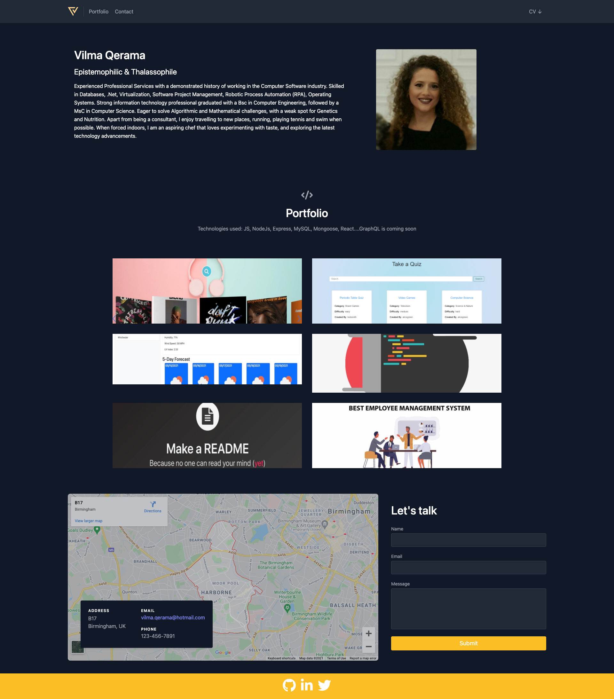
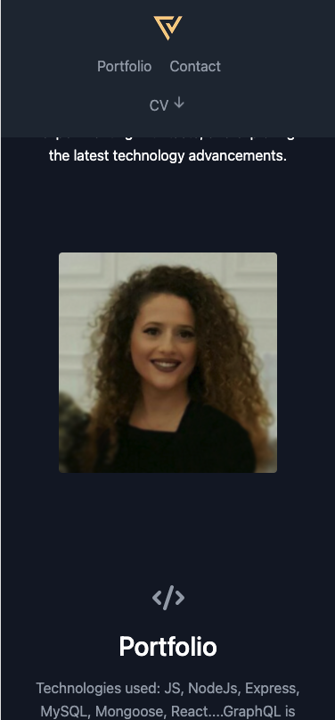

# react-js-portfolio

This is a portfolio build using React principles. It has 7 components:

- Header
- Navbar
- CV
- About
- Portfolio
- Contact
- Form
- Footer

Navbar & CV are called as a child of the Header component.
Portfolio

Folder & Files organisation as follows:

|── README.md  
├── node_modules  
├── package.json 
├── .gitignore 
├── public 
│ ├── favicon.ico 
│ ├── index.html 
│ └── manifest.json 
└── src 
├── App.js 
├── data.js 
├── index.css 
├── index.js 
└── components 
├── About.js 
├── Contact.js 
├── Navbar.js 
├── CV.js  
├── Portfolio.js 
└── Contact.js 
└── Footer.js 

## Table of Contents

- [react-js-portfolio](#react-js-portfolio)
  - [Table of Contents](#table-of-contents)
  - [Technologies used](#technologies-used)
    - [TailWindCSS](#tailwindcss)
  - [Getting started](#getting-started)
      - [Start app for development:](#start-app-for-development)
  - [Printscreens](#printscreens)
  - [Links](#links)
  - [Read more](#read-more)

## Technologies used

- Javascript
- React - Gives the possibility to expand the SPA to as many pages we need very simply.
- TailWindCSS - you can still be stylish without a style.css
- Craco - Create React App Configuration Override is an easy and comprehensible configuration layer for create-react-app.

### TailWindCSS

Benefits: with TailWind CSS you can easily style the components without needing a css stylesheet. To add the desired style you have just to add and combine the needed classes.
Cons: The most beautiful styles are not free, subscription is required.

## Getting started

1. ` npm install`
2. Install Tailwind and its peer-dependencies using npm: 

   `npm install -D tailwindcss@npm:@tailwindcss/postcss7-compat postcss@^7 autoprefixer@^9`

3. Install Craco  
   `npm install @craco/craco --save`
4. Generate tailwind.config.js file:
   `npx tailwindcss-cli@latest init`

#### Start app for development:

$ npm run start

## Printscreens

Portfolio view in full screen

Mobile View

## Links

[Github](https://github.com/vilmaq/react-js-portfolio)

[Netlify](https://wizardly-wright-d27a45.netlify.app/)

## Read more

For more information:

https://tailwindcss.com/docs/guides/create-react-app 
Use the following link to generate the Embedded Google Maps Locations (use only the src tag):  
https://www.embed-map.com/
